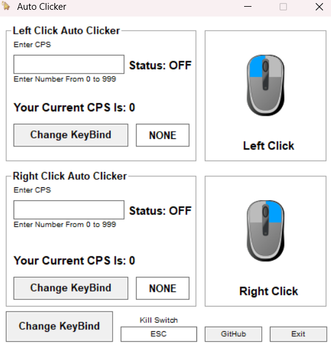
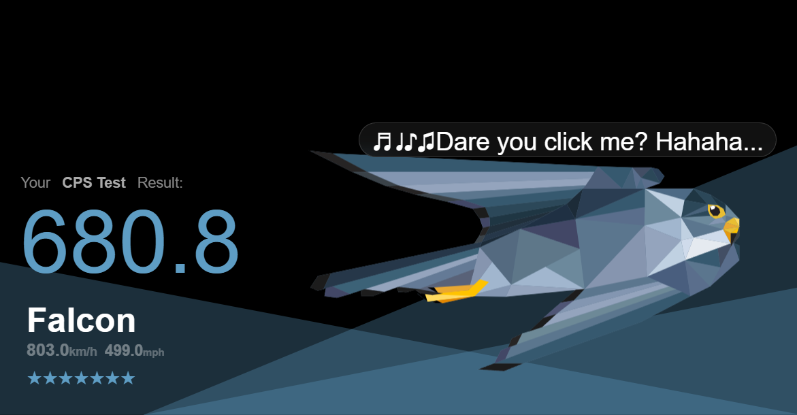

# Auto-Clicker
Are You Tired?  
Same But Now You Can Use Super OP Auto Clicker While You Are Tired  

Written in C. WIN32

Features:  
- Left Click Auto Clicker  
- Right Click Auto Clicker  
- Kill Switch In Case You Mess Thing Up  

How to Use:
Option 1: Run The .exe file  
Option 2: Clone the repository and compile it yourself In VScode  

  

Download:
You can download the latest .exe from the Releases tab.

License:  
MIT License  
DO NOT PROFIT OF THIS PROGRAM. THIS IS INTENDED TO BE OPEN SOURCE AND FREE.  
IF YOU KNOW SOMEONE IS USING IT TO PROFIT CONTACT ME.
Email: harpcheemse@gmail.com
